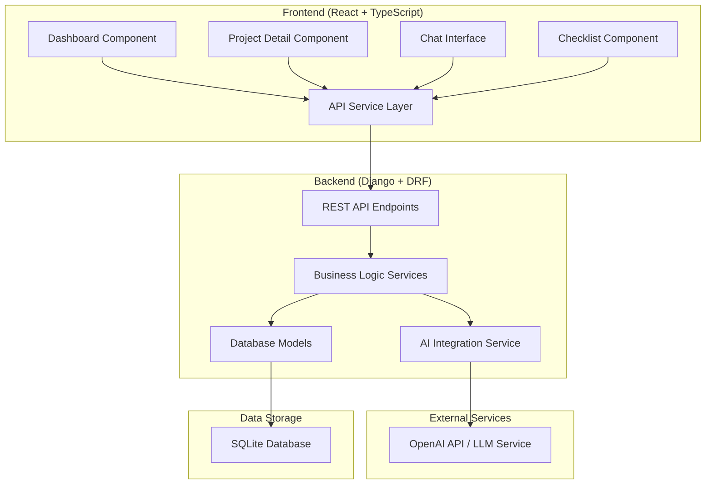

# Design Document

## Overview

The AI Concierge MVP is a simplified full-stack web application built with Django REST Framework backend and React TypeScript frontend. The system provides specialized AI-powered concierge services without user authentication, focusing on core functionality: project management, AI conversations, and dynamic task tracking.

## Architecture

### High-Level Architecture



### Technology Stack

**Backend:**
- Django 4.2+ with Django REST Framework
- SQLite database for simplicity
- Python 3.9+
- django-cors-headers for CORS support
- python-dotenv for environment management
- requests library for AI API integration

**Frontend:**
- React 18+ with TypeScript
- Vite for build tooling
- React Router for navigation
- Axios for API communication
- Tailwind CSS for styling
- React Context for state management

**Deployment:**
- Docker and Docker Compose
- Environment-based configuration

## Components and Interfaces

### Backend Components

#### 1. Database Models

**ConciergeProject Model:**
```python
class ConciergeProject(models.Model):
    id = models.AutoField(primary_key=True)
    title = models.CharField(max_length=200)
    type = models.CharField(max_length=50, choices=[
        ('travel', 'Travel Concierge'),
        ('wedding', 'Wedding Concierge'),
    ])
    progress = models.FloatField(default=0.0)  # 0.0 to 1.0
    created_at = models.DateTimeField(auto_now_add=True)
    updated_at = models.DateTimeField(auto_now=True)
```

**Message Model:**
```python
class Message(models.Model):
    id = models.AutoField(primary_key=True)
    project = models.ForeignKey(ConciergeProject, on_delete=models.CASCADE)
    role = models.CharField(max_length=20, choices=[
        ('user', 'User'),
        ('assistant', 'Assistant'),
    ])
    content = models.TextField()
    created_at = models.DateTimeField(auto_now_add=True)
```

**ChecklistItem Model:**
```python
class ChecklistItem(models.Model):
    id = models.AutoField(primary_key=True)
    project = models.ForeignKey(ConciergeProject, on_delete=models.CASCADE)
    description = models.CharField(max_length=500)
    completed = models.BooleanField(default=False)
    created_at = models.DateTimeField(auto_now_add=True)
    updated_at = models.DateTimeField(auto_now=True)
```

#### 2. REST API Endpoints

**Project Management:**
- `GET /api/projects/` - List all projects
- `POST /api/projects/` - Create new project
- `GET /api/projects/{id}/` - Get project details
- `PUT /api/projects/{id}/` - Update project
- `DELETE /api/projects/{id}/` - Delete project

**Messages:**
- `GET /api/projects/{id}/messages/` - Get conversation history
- `POST /api/projects/{id}/messages/` - Send message and get AI response

**Checklist Items:**
- `GET /api/projects/{id}/checklist/` - Get project checklist
- `POST /api/projects/{id}/checklist/` - Create checklist item
- `PUT /api/checklist/{id}/` - Update checklist item
- `DELETE /api/checklist/{id}/` - Delete checklist item

**AI Integration:**
- `POST /api/ai/respond/` - Process message and return AI response with potential checklist updates

#### 3. AI Integration Service

**AIService Class:**
```python
class AIService:
    def __init__(self):
        self.api_key = os.getenv('OPENAI_API_KEY')
        self.base_url = os.getenv('AI_API_BASE_URL', 'https://api.openai.com/v1')
    
    def generate_response(self, project_type: str, conversation_history: List[dict], user_message: str) -> dict:
        # Returns: {
        #     'response': str,
        #     'suggested_checklist_items': List[str]
        # }
    
    def get_system_prompt(self, project_type: str) -> str:
        # Returns specialized prompts for different concierge types
```

### Frontend Components

#### 1. Component Structure

**App Component:**
- Main application wrapper
- Router configuration
- Global state management

**Dashboard Component:**
- Project list display
- New project creation
- Project type selection

**ProjectDetail Component:**
- Project header with title and progress
- Chat interface integration
- Checklist display
- Navigation between chat and checklist views

**ChatInterface Component:**
- Message display with role-based styling
- Message input and send functionality
- Loading states for AI responses
- Auto-scroll to latest messages

**ChecklistComponent:**
- Checklist item display with completion status
- Toggle completion functionality
- Progress calculation and display

#### 2. State Management

**Project Context:**
```typescript
interface ProjectContextType {
  projects: ConciergeProject[];
  currentProject: ConciergeProject | null;
  loading: boolean;
  error: string | null;
  createProject: (title: string, type: string) => Promise<void>;
  selectProject: (id: number) => Promise<void>;
  updateProject: (id: number, updates: Partial<ConciergeProject>) => Promise<void>;
  deleteProject: (id: number) => Promise<void>;
}
```

**Chat Context:**
```typescript
interface ChatContextType {
  messages: Message[];
  sendMessage: (content: string) => Promise<void>;
  loading: boolean;
  error: string | null;
}
```

#### 3. API Service Layer

**ApiService Class:**
```typescript
class ApiService {
  private baseURL: string;
  
  // Project methods
  async getProjects(): Promise<ConciergeProject[]>
  async createProject(data: CreateProjectData): Promise<ConciergeProject>
  async getProject(id: number): Promise<ConciergeProject>
  async updateProject(id: number, data: UpdateProjectData): Promise<ConciergeProject>
  async deleteProject(id: number): Promise<void>
  
  // Message methods
  async getMessages(projectId: number): Promise<Message[]>
  async sendMessage(projectId: number, content: string): Promise<{message: Message, checklist_updates: ChecklistItem[]}>
  
  // Checklist methods
  async getChecklist(projectId: number): Promise<ChecklistItem[]>
  async updateChecklistItem(id: number, completed: boolean): Promise<ChecklistItem>
}
```

## Data Models

### Frontend TypeScript Interfaces

```typescript
interface ConciergeProject {
  id: number;
  title: string;
  type: 'travel' | 'wedding';
  progress: number;
  created_at: string;
  updated_at: string;
}

interface Message {
  id: number;
  project: number;
  role: 'user' | 'assistant';
  content: string;
  created_at: string;
}

interface ChecklistItem {
  id: number;
  project: number;
  description: string;
  completed: boolean;
  created_at: string;
  updated_at: string;
}
```

### Database Schema

```sql
-- Projects table
CREATE TABLE concierge_project (
    id INTEGER PRIMARY KEY AUTOINCREMENT,
    title VARCHAR(200) NOT NULL,
    type VARCHAR(50) NOT NULL,
    progress REAL DEFAULT 0.0,
    created_at DATETIME NOT NULL,
    updated_at DATETIME NOT NULL
);

-- Messages table
CREATE TABLE message (
    id INTEGER PRIMARY KEY AUTOINCREMENT,
    project_id INTEGER NOT NULL,
    role VARCHAR(20) NOT NULL,
    content TEXT NOT NULL,
    created_at DATETIME NOT NULL,
    FOREIGN KEY (project_id) REFERENCES concierge_project (id)
);

-- Checklist items table
CREATE TABLE checklist_item (
    id INTEGER PRIMARY KEY AUTOINCREMENT,
    project_id INTEGER NOT NULL,
    description VARCHAR(500) NOT NULL,
    completed BOOLEAN DEFAULT FALSE,
    created_at DATETIME NOT NULL,
    updated_at DATETIME NOT NULL,
    FOREIGN KEY (project_id) REFERENCES concierge_project (id)
);
```

## Error Handling

### Backend Error Handling

**API Error Responses:**
```python
# Standard error response format
{
    "error": {
        "code": "VALIDATION_ERROR",
        "message": "Invalid project type provided",
        "details": {
            "field": "type",
            "allowed_values": ["travel", "wedding"]
        }
    }
}
```

**Error Categories:**
- Validation errors (400)
- Not found errors (404)
- AI service errors (502)
- Internal server errors (500)

**AI Service Error Handling:**
- Timeout handling with fallback responses
- API key validation
- Rate limit handling
- Graceful degradation when AI service is unavailable

### Frontend Error Handling

**Error Display Strategy:**
- Toast notifications for temporary errors
- Inline error messages for form validation
- Error boundaries for component-level failures
- Retry mechanisms for network failures

**Loading States:**
- Skeleton loaders for initial data loading
- Spinner indicators for AI response generation
- Disabled states for form submissions
- Progress indicators for long-running operations

## Testing Strategy

### Backend Testing

**Unit Tests:**
- Model validation and business logic
- API endpoint functionality
- AI service integration
- Database operations

**Integration Tests:**
- End-to-end API workflows
- Database transaction handling
- AI service mock integration

**Test Coverage Goals:**
- Models: 90%+ coverage
- Views/APIs: 85%+ coverage
- Services: 80%+ coverage

### Frontend Testing

**Component Tests:**
- Individual component rendering
- User interaction handling
- State management
- API integration

**Integration Tests:**
- User workflow testing
- Cross-component communication
- API service integration

**E2E Tests:**
- Critical user paths
- Project creation and management
- Chat functionality
- Checklist operations

### Testing Tools

**Backend:**
- Django's built-in testing framework
- pytest for advanced testing features
- Factory Boy for test data generation
- Mock for AI service testing

**Frontend:**
- Jest for unit testing
- React Testing Library for component testing
- MSW (Mock Service Worker) for API mocking
- Cypress for E2E testing

## Deployment Architecture

### Development Environment

**Docker Compose Configuration:**
```yaml
version: '3.8'
services:
  backend:
    build: ./concierge_backend
    ports:
      - "8000:8000"
    environment:
      - DEBUG=True
      - OPENAI_API_KEY=${OPENAI_API_KEY}
    volumes:
      - ./concierge_backend:/app
  
  frontend:
    build: ./concierge_frontend
    ports:
      - "3000:3000"
    environment:
      - REACT_APP_API_URL=http://localhost:8000
    volumes:
      - ./concierge_frontend:/app
```

### Environment Configuration

**Backend (.env):**
```
DEBUG=True
SECRET_KEY=your-secret-key
OPENAI_API_KEY=your-openai-key
AI_API_BASE_URL=https://api.openai.com/v1
CORS_ALLOWED_ORIGINS=http://localhost:3000
```

**Frontend (.env):**
```
REACT_APP_API_URL=http://localhost:8000
REACT_APP_APP_NAME=AI Concierge MVP
```

### Production Considerations

**Security:**
- Environment variable management
- CORS configuration
- API rate limiting
- Input validation and sanitization

**Performance:**
- Database indexing for frequently queried fields
- API response caching
- Frontend code splitting
- Image and asset optimization

**Monitoring:**
- Basic logging for API requests
- Error tracking
- AI service usage monitoring
- Performance metrics collection